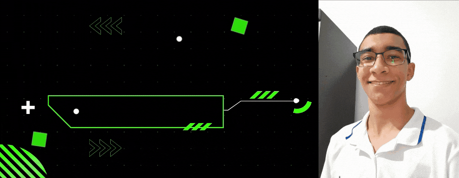

<!-- Cover -->

	

<!-- Social Networks -->
&nbsp;
&nbsp;
&nbsp;
&nbsp;
&nbsp;

## E aí, beleza? 🤙🏽

👨🏽‍💻 Me chamo **Mateus Jesus**, tenho 21 anos e sou graduando em Sistemas de Informação. Gosto de tecnologia, IA, games e estou focado na área de **Front-end**.

🚀 Atualmente estudo na plataforma da [Rocketseat](https://rocketseat.com.br/). Faço parte da 1ª turma do Ignite na trilha de ReactJS.

<!-- Languages, libs and frameworks -->
&nbsp;
&nbsp;
&nbsp;
&nbsp;
&nbsp;
&nbsp;

<!-- Tools Front-end -->
&nbsp;
&nbsp;
&nbsp;
&nbsp;
&nbsp;

<!-- Skills -->
Estão aqui algumas das minhas habilidades e conhecimentos como Desenvolvedor Front-end:
- 💻 **Front-end**: HTML, CSS (Media Query, Animation, Flexbox, Grid), JavaScript (jQuery, ES6+, Typescript), Bootstrap.
- 🔠 **Linguagens**: HTML/CSS, JavaScript, ES6+, Typescript.
- 🆚 **Versionamento**: Git.
- 🧪 **Testes e automatização**: JEST.
- 🏗️ **Infraestrutura**: HTTP, Windows 10.
- 👷🏻 **Arquitetura**: Rest, Orientação a Objetos.
- 📈 **Engenharia de Software**: Levantamento de requisitos, UML, Scrum e Kanban.
